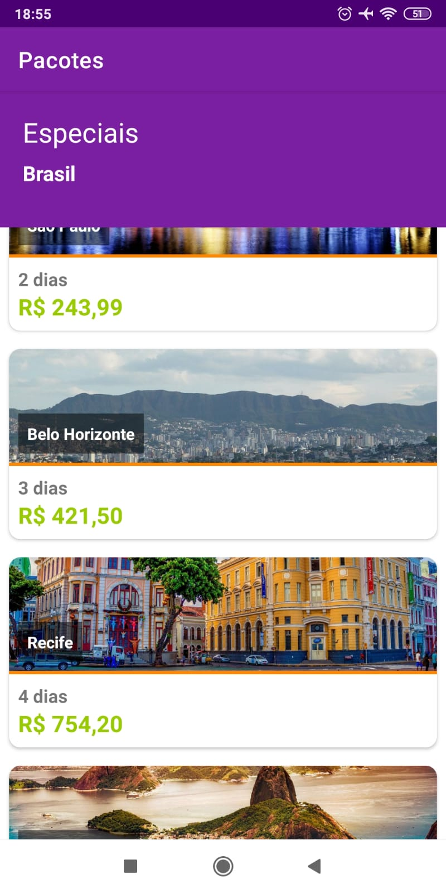
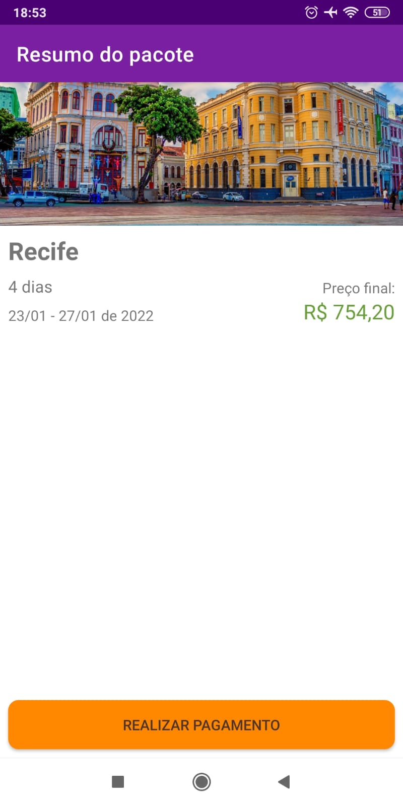
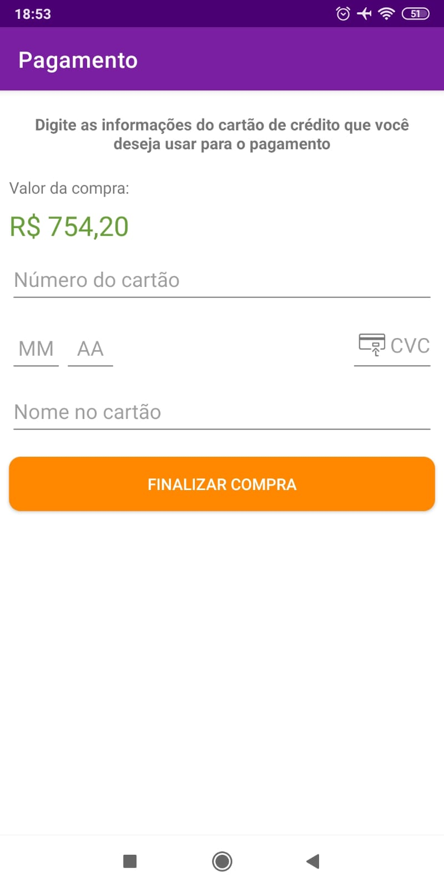
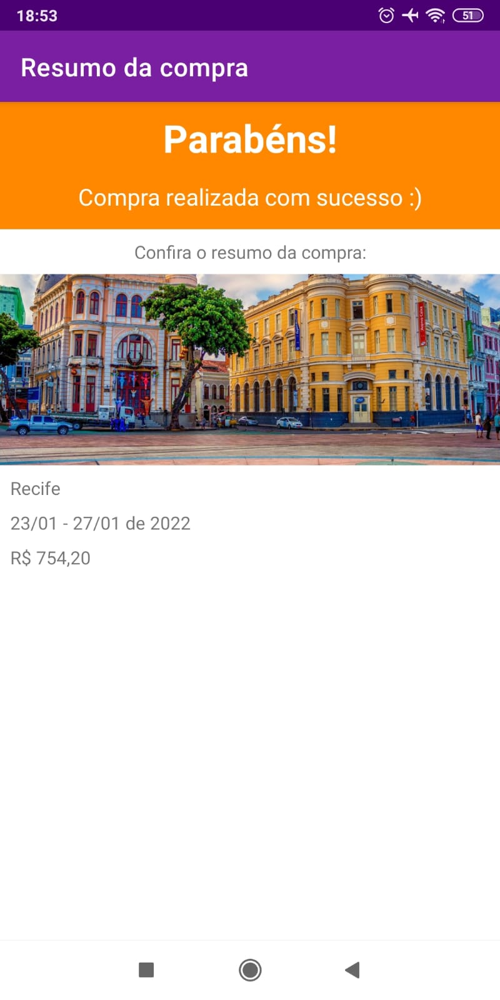

# Aplicativo de viagens 

Estou desenvolvendo junto com as aulas do instrutor do curso de Constraint Layouts da Alura esse aplicativo.

## 📲 Demonstração

Capturas de tela do aplicativo:
 
  

 

Demonstração de uso:

## Instalação

Crie um projeto no Android Studio 2020.3.1, escolha API 12 e selecione a opção de não criar activity. Escolha como package br.com.daniel.danielviagens
Por último sobrescreva os diretórios com os arquivos que estão aqui.
